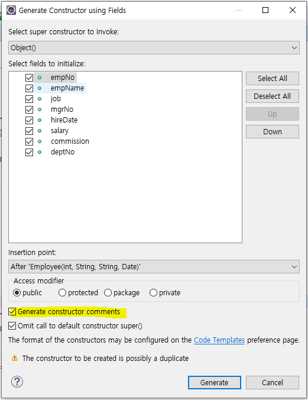
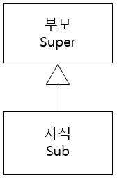

# 200107 java 실습 1

> java : 실행 명령어
>
> javac : 컴파일러
>
> javadoc : api를 만드는 실행파일
>
> **classpath** : javac, java가 사용한 클래스의 경로를 찾는 순서
>
>  1. rt.jar : 자바가 제공하는 경로
>
>  2. jdk/jre/lib/ext > *.jar
>
>  3. set classpath=설정폴더 : 사용자가 환경변수에 임의로 설정해 놓은 경로
>
>     ​										    만약, 사용자가 환경변수를 설정해 놓지 않으면
>
>     ​										    자바가 현재 실행되고 있는 Working 폴더에서 찾음 (현재 폴더)
>
> 4. 자바 소스코드에서 설정하려면, import 구문으로 사용한 클래스의 경로를 명시해야 함
>
>    ※ 생략 가능한 package : java.lang.*


## Eclipse

### 0. workspace 환경설정

- euc-kr / ksc5601 : 한글/영어만 지원
- utf-8 : 다국어 지원, html5, ajax
  - [Window] - [preferences] - [general] - [workspace] - utf-8
  - [Window] - [preferences] - [web] - [CSS File] - utf-8
  - [Window] - [preferences] - [web] - [HTML File] - utf-8
  - [Window] - [preferences] -[web] - [JSP File] - utf-8


- [java] - [build path] - output folder name 

  bin -> classes 변경

## 

### 1. 프로젝트 생성

- java project - jre 1.8 사용


### 2. 실습

1. 윤년 / 평년

   ``` java
   public class LeapYearTest {
   	public static void main(String[] args) {
   		int[] years = { 2000, 2016, 2019, 2020, 2100, 1994 };
   		for (int year : years)
   			System.out.println(LeapYear.isLeapYear(year) ? "윤년" : "평년");
   	}
   }
   class LeapYear {
   	/**
   	 * <pre>
   	 * 	윤년여부를 계산하는 메서드
   	 *  
   	 *  # 윤년 계산 알고리즘
   	 *  1. 해당 년도가 4의 배수이면서
   	 *  2. 해당 년도가 100의 배수가 아니거나, 400의 배수인 경우는 윤년에 해당
   	 * 
   	 * </pre>
   	 * 
   	 * @param year
   	 * @return 윤년이면 true, 평년이면 false
   	 */
   	public static boolean isLeapYear(int year) {
   		return year % 4 == 0 ? year % 100 != 0 || year % 400 == 0 ? true : false : false;
   	}
   }
   ```

2. 날짜 형식

   ``` java
   import java.text.SimpleDateFormat;
   import java.util.Date;
   
     SimpleDateFormat
   ```

   

# JAVA

### 식별자 명명 규칙

- class는 대문자
- method는 카멜 케이스 기반
- 변수와 메서드는 소문자로 시작
- 패키지명은 모두 소문자


### 특징

- OOP : 객체 지향
  - 실제 세계에 존재하는 개체 또는 개념
  - 구성요소 : 속성 + 메서드로 결합된 객체
- 추상화 (Abstraction) 
- 은닉성 (Encapsulation) 
- 상속성 (Inheritance) 
- 다형성 (Polymorphism) = Overriding : 부모로부터 물려받은 객체를 재정의
- final class: 상속 불가

- **단일 상속**만 지원 / **다중 구현** (interface -> 형식만 주기 때문에 반드시, 재정의) 가능


### Abstraction

- 


### 자바 소스코드 파일 구조

- package 선언문 : 형식 : package top.sub;

  - 선언 횟수 : 0,1
  - **왜 패키지로 관리할까? 효율적, 이름 충돌 회피, 권한 제어**

  

- import 선언문

  - 형식 : import.top.sub.*;

     		  import.top.sub.클래스이름;

  - 선언 횟수 : 0 ~ n번

  

- class 선언문
  - 형식 : top.sub.클래스이름 참조변수명 = new top.sub.클래스이름();
  - 선언 횟수 : 1 ~ n번


### 데이터 타입

- 기본형 (Primitive type)
  - 정수 : byte, short, **int** , long		        	⇒	기본값 : 0
  - 단일 문자형 : char	                                ⇒	'\u0000' , 공백 문자
  - 논리형 : boolean	                                  ⇒	false
  - 실수형 : float(32bit) , **double** (64bit)	 ⇒	0.0

  

- 참조형 (Object type / reference type)
  - 모든 클래스, 추상 클래스, 인터페이스	⇒	null
  - 문자열 : string                                       	⇒	null
  - 배열                                                        	⇒	null


### 접근 권한 : Access Modifier

- public : 누구나 접근 가능
- protected : 상속시 가능 (sub class)
- 생략, default , package, friendly : same package
- private : same class (외부에서 접근 불가)


### Class

- 클래스 생성

  ``` java
  // class를 이용하여 객체 생성하기
  // 클래스이름 참조변수명 = new 클래스이름();
  Employee e1 = new Employee();
  
  // 생성한 객체의 멤버(변수,메서드) 사용 방법
  // . 을 이용해서 참조함
  // 참조변수명.멤버변수명
  // 참조변수명.멤버메서드명
  emp1.empNo = 7369;
  emp1.empName = "SMITH";
  emp1.job = "CLERK";
  emp1.mgrNo = 7902;
  emp1.hireDate = Utility.toDate("1980-12-17");
  emp1.salary = 800;
  emp1.deptNo = 20;
  ```

  

 - **객체 생성 순서**

   1. 메모리 할당

   2. 기본값 자동 초기화

   3. 명시적 초기값으로 자동 초기화 : 클래스 멤버변수 선언시에 초기화 한 값

      ``` java
      public class Person{
      	public int name = "ㅇㅇㅇ";
          ...
      }
      ```

   4. 생성자 수행

   5. 생성한 객체를 참조할 수 있는 참조값(Reference value)를 할당

      ``` java
      public static void main(String[] args) {
          Person p = new Person();
          p.name = "ㅁㅁㅁ";
          ...
      }
      ```


- 생성자

  ``` java
  접근권한 클래스이름( [arg] ) { ... }
  ```

  - 목적 : 객체 생성시 멤버 변수 초기화, 선행 처리해야 하는 로직 수행

  - **객체 생성시에 JVM에 의해 호출 됨**

  - 모든 클래스는 1개 이상의 생성자를 중복 정의 가능

  - 사용자가 명시적으로 생성자를 정의하지 않으면,

    컴파일러가 자동으로 default 생성자를 제공함

    ``` java
    public 클래스이름(){}
    ```

  - **사용자가 명시적으로 생성자를 정의하는 경우에는,**

    **컴파일러가 자동으로 기본 생성자를 제공하지 않음**

    

### Annotation

> jdk 1.5 추가

- 종류
  - java 표준

    `@Override`

    - 컴파일시에 재정의 규칙 검증 어노테이션
    - 상속시에 부모가 선언해 놓은 메서드의 형식 위반시에 컴파일 오류 발생
    - 재정의 규칙
      - **반환 타입 메서드명(Argument의 type, 갯수, 순서) 동일**
      - **접근 권한** : 확대만 가능 → 축소 불가
      - Exception : 축소 가능 → 확대 불가
      - 코드 구현부만 자식에 맞게 변경 가능

    `@Depricated`

    - 곧 사라질 메서드
    - 참고 사이트 : https://docs.oracle.com/javase/8/docs/api/

    `@param`

    - 생성자 생성 시 체크하면

    

    

    - API 문서를 HTML 형식으로 만들어주는 어노테이션

      - \<pre> ...  \</pre> : 내용의 형식을 그대로 유지 

      ``` java
      // API 문서를 HTML 형식으로 만들어주는 어노테이션
      /**
       * @param empNo 사번
       * @param empName 사원이름
       * @param job 직무
       * @param hireDate
       * 
       * @author ooo
       * @since jdk 1.8
       * @see java.lang.String
       * 
       * <pre>
       * 모든 데이터와 생성자
       * 야후~
       * </pre>
       */
      ```

  - 사용자 정의
  - Framework 정의
    - Spring F/W
    - Mybatis F/W
    - eGov F/w (전자정부 표준 프레임워크)


### Overloading : 중복 정의

- 이름 동일
- 메서드의 argument 개수, 순서, 타입 동일
- 코드 구현, 접근 권한, 예외는 상관 없음 (동일, 축소, 확대 모두 상관없음)


### SDLC:  **Software Development Life Cycle**

1. 요구사항 수집

   - 기능 ( CRUD )
   - 비기능 ( 성능, 안정성, 인프라, 분산처리, 트랜잭션 )

2. 분석 / 설계 → 표준화 → 산출물 ( UML , 다이어그램, ERD ...)

3. 개발

4. 테스트 : 고객이 원한 것이 맞는지 V & V 

   ​			   (개발자가 Debug하는 test를 말하는 것 아님)

5. 운영화 (안정화) / 배포


### Inheritance : 상속



- Sub **is a** Super 관계를 성립해야 함

  ex) 학생은 사람이다

- 부모의 Private은 상속 X
- 부모의 생성자는 자식이 명시적으로 지정해줘야 함 → 부모의 생성자 중 어떤 생성자를 사용할 것인지

- 최상위 부모 클래스 : **object**
  - toString()
  - equals() + hashcode()


### **Abstract Class** : 추상 클래스

- 멤버 메서드에서 추상 메서드가 하나라도 있는 클래스

  ``` java
  public abstract class ReportAbstract {
      public abstract void report();
  }
  ```

- 메모리를 할당 받을 수 없다 → **직접 객체를 생성할 수 없다**

- **상속을 강제**하기 위해서 추상 메서드가 없어도 추상 클래스로 선언하는 경우가 있음

  ⇒ **일반화 / 표준화**

- But, 클래스는 다중 상속 받을 수 없음!

  ⇒ 다중 상속이 필요한 경우에는 interface를 사용


### Interface

- 구성 요소 : **추상 메서드** + 상수

  - 추상 메서드 : 상속받은 자식이 **무조건 재정의** 해야 함

  ``` java
  public interface InterfaceA{
      (public static final) String name = "KT";
      (public abstract) void doA();
  }
  
  // InterfaceA를 구현할 때
  public class A implement InterfaceA{
  	void doA(int a){} // overloading
      
      @Override
      (default) void doA(){} // overriding X : ERROR!
      					   // 부모의 doA의 접근권한 > 자식의 doA의 접근권한
      					   // 접근 권한은 확장만 가능
      					   // (public, protected)
  }
  ```


