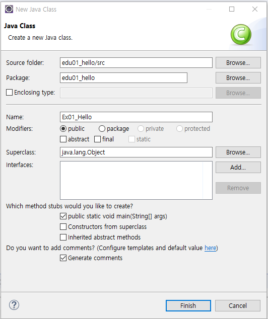

# 200107 java 실습

> java : 자바 실행파일
>
> javac : 컴파일러
>
> javadoc : api를 만드는 실행파일


## Eclipse

### 0. workspace 환경설정

- euc-kr / ksc5601 : 한글/영어만 지원
- utf-8 : 다국어 지원, html5, ajax
  - [Window] - [preferences] - [general] - [workspace] - utf-8
  - [Window] - [preferences] - [web] - [CSS File] - utf-8
  - [Window] - [preferences] - [web] - [HTML File] - utf-8
  - [Window] - [preferences] -[web] - [JSP File] - utf-8


- [java] - [build path] - output folder name 

  bin -> classes 변경

## 

### 1. 프로젝트 생성

- java project - jre 1.8 사용




### 2. java 명명 규칙

- class는 대문자
- method는 카멜 케이스 기반
- 변수와 메서드는 소문자로 시작
- 패키지명은 모두 소문자


### 3. 실습

1. 윤년 / 평년

   ``` java
   public class LeapYearTest {
   	public static void main(String[] args) {
   		int[] years = { 2016, 2019, 2020, 2100, 1994 };
   		for (int year : years)
   			System.out.println(LeapYear.isLeapYear(year) ? "윤년" : "평년");
   	}
   }
   class LeapYear {
   	/**
   	 * <pre>
   	 * 	윤년여부를 계산하는 메서드
   	 *  
   	 *  # 윤년 계산 알고리즘
   	 *  1. 해당 년도가 4의 배수이면서
   	 *  2. 해당 년도가 100의 배수가 아니거나, 400의 배수인 경우는 윤년에 해당
   	 * 
   	 * </pre>
   	 * 
   	 * @param year
   	 * @return 윤년이면 true, 평년이면 false
   	 */
   	public static boolean isLeapYear(int year) {
   		return (year % 4 == 0 && year % 100 != 0) || (year % 400 == 0) ? true : false;
   	}
   }
   ```

