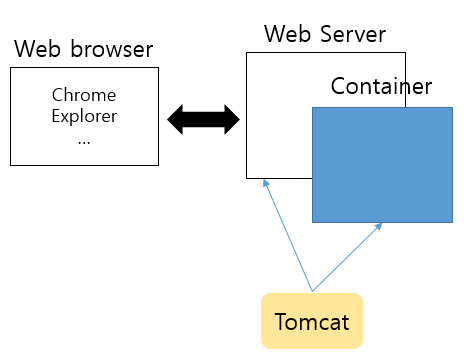
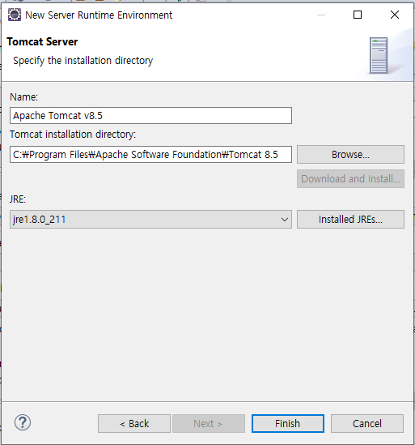
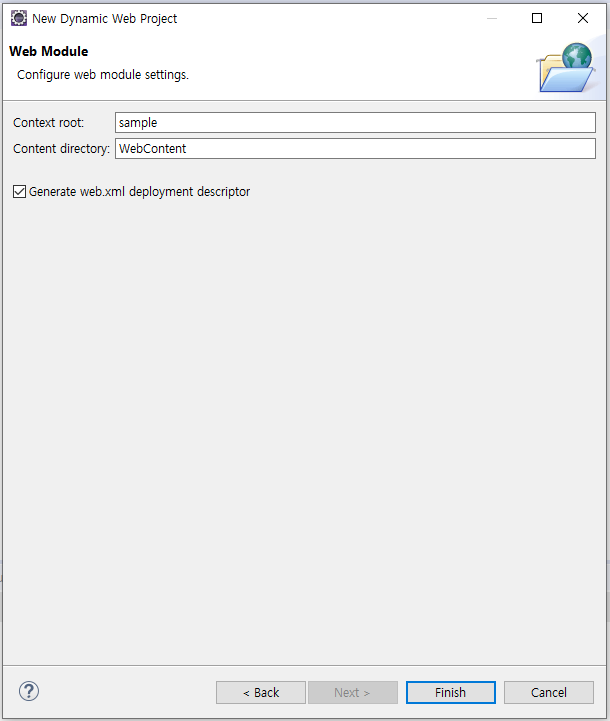
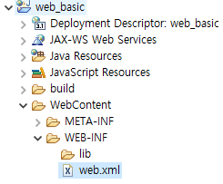

# 200108_java 실습 2

## MVC Pattern


- Model : 실제 비지니스 로직 / Service를 실행하는 부분

- View : 사용자가 보는 UI , Presentation Logic 

- Control : 사용자의 요청을 제어 → Model로 보냄

  ​				 응답 화면 제어 → View를 보내줌


- Web framework
  - Struts f/w
  - spring f/w
  - eGov f/w

Web Architecture



컨테이너 : 생명 주기를 제어

​					java/ servlet역할


web server


이거를 둘다하는 애는 톰캣


앞단에는 웹 브라우저


## Web

#### 0. 프로젝트 생성

- Dynamic web project

- target runtime : 어떤 web server에서 돌릴거야

  



-



``` html
<?xml version="1.0" encoding="UTF-8"?>
<web-app xmlns:xsi="http://www.w3.org/2001/XMLSchema-instance" xmlns="http://xmlns.jcp.org/xml/ns/javaee" xsi:schemaLocation="http://xmlns.jcp.org/xml/ns/javaee http://xmlns.jcp.org/xml/ns/javaee/web-app_3_1.xsd" id="WebApp_ID" version="3.1">
  <display-name>web_basic</display-name>
  <welcome-file-list>
      <!-- Web의 시작 페이지 설정 -->
    <welcome-file>login.html</welcome-file>
  </welcome-file-list>
</web-app>
```


## HTML

- `<br>` : 라인 이동

- `<p>` : 단락이동

- `<a href="페이지 url" target="창 뜨는 옵션">  or 글자 </a>` : 페이지 링크

- `` : 이미지 삽입, 형식 (png, gif, jpg)

- `<div>` : 페이지 레이아웃

  ​		 	  **block** tag : 자동으로 라인 이동이 발생하는 태그

-  `<span>` : 페이지 레이아웃

  ​				**inline** tag : 라인 이동이 발생하지 않는 태그

- `<hr>` : 수평선