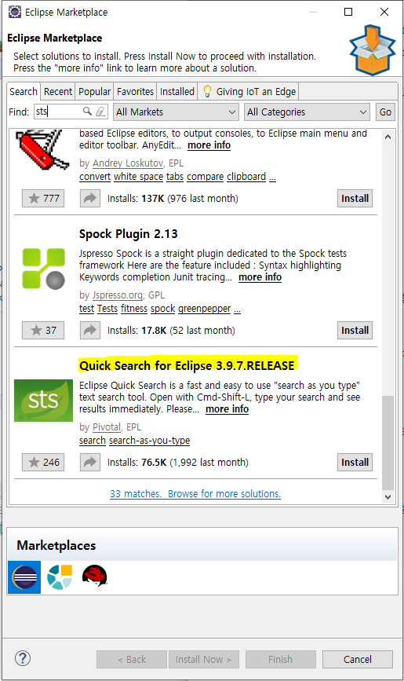
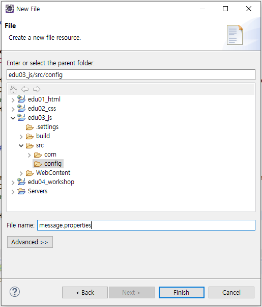
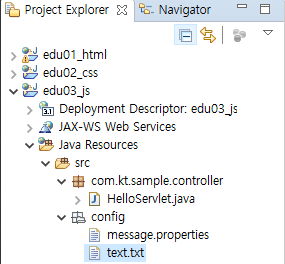
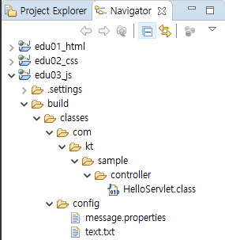
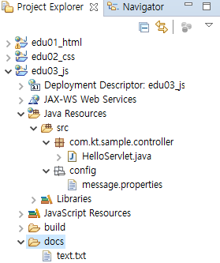
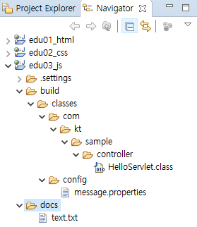

# 200109_Spring 실습

## 오라클 환경설정

> sqlplus : 오라클 설치시 기본으로 제공되는 sql 편집기

1. 관리자 계정 오라클 서버 연결

   `SQL> sqlplus system/1234;`

2. hr 계정 lock 해제

   `SQL> alter user hr account unlock;`

3. hr 계정 암호 변경

   `SQL> alter user hr identified by tiger;`

4. 새로운 계정 생성

   `SQL> create user scott identified by tiger;`
   권한 부여
   `SQL> grant connect, resource, create view to soctt;`

5. 오라클 서버 연결 끊기
   `SQL> discon;`

6. 오라클 서버 사용자 계정 연결

   `SQL> conn hr/tiger`

7. 접속 끊기

   `SQL> quit or exit`

------------------------------

- 현재 DB에 있는 모든 Table 목록 조회

  `SQL> select * from tab;`

- 간격 설정 → 콘솔 기반에서 저장되지 않음

  `SQL> set linesize 300;`
  `SQL> set pagesize 300;`

- 현재 연결된 사용자 

  `SQL> show user`

- 주석

  ``SQL> --`

- 화면 clear

  `SQL> cl scr`

- 환경 설정

  `SQL> set property이름 설정값`

- 전체 property 조회

  `SQL> show all`

  

## Eclipse에서 STS 설치




## Java Bean Component 규칙

>  java bean : 규칙을 준수한 자바 클래스

1. package 선언

2. private 멤버 변수 선언
3. public setter() 메서드 선언
4. public getter() 메서드 선언

5. 기본 생성자 선언 : no argument

   ``` java
   // 예시
   package com.sample.bean;
   public class Member{
       private String memberId;
    	private String memberPw;
       
       public Member(){}
       
       public void setMemberId(String memeberId){
           this.memeberId = memeberId;
   	}
       
      	public void getMemberId(){
           return memeberId;
   	}
       public void setMemberPw(String memeberPw){
           this.memeberPw = memeberPw;
   	}
       
      public void getMemberPw(){
           return memeberPw;
   	}
   }
   ```

   

#### Web Application 구성요소 (파일)

- static 파일 

  ex) html, css, js, image, 미디어 파일, ...

- 환경설정 파일 

  web.xml (문서 타입 준수!)

- 자바 코드(소스) 파일

  ex) *.java → complie → *.class

- library 파일 : 다른 플랫폼을 사용할 때, ...

  ex) *.jar

  ​						**↓**

#### 서버에 배포 (deploy) : tomcat 기반일 때

- tomcat / wepapps / project (= contenxt_name, 여러개의 app이 배포될 수 있으므로) /

  : static 폴더 자리

- tomcat / wepapps / contenxt_name / WEB-INF

  : 환경설정 , web.xml 자리

- tomcat / wepapps /contenxt_name / WEB-INF / classes → **classpath 이곳! **

  : 컴파일 된 자바 파일, * class

- tomcat / wepapps / contenxt_name / WEB-INF / lib

  : library 파일, *.jar


#### **Eclipse 개발환경**

> webproject일 때,

- java resources/src/ : *.java

  컴파일시, src에 자바 파일이 아닌 파일이 있으면

  classpath 아래에 xcopy해줌 (구조를 그대로 복사 )

- WebContent/  : static 파일

- WebContent/ WEB-INF  : web.xml

- WebContent/ WEB-INF / lib : *.jar

- build / classes : *.class


Spring (web) 구조 다르지만 배포시에는 배포 구조와 같아야 함!


---

#### 진짜 XCOPY가 되나 해보자!

- src / config 폴더 생성

- [File] - [New] -[File] -  message.properties 생성




- [Window] - [Show view] - [Navigator] : 물리적 탐색기





- **컴파일시, src에 자바(코드) 파일이 아닌 파일이 있으면**

  **classpath 아래에 xcopy해줌 (구조를 그대로 복사 )**

- src 안에는 코드나 리소스 파일 아닌 참고 문서는 두면 안 됨! 

  배포시, 그대로 배포됨

  

