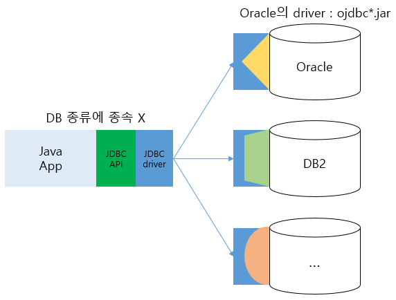
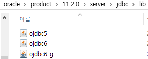
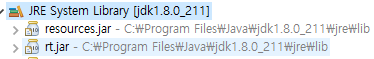
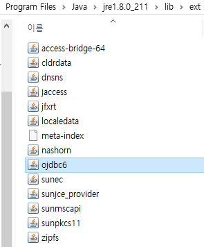
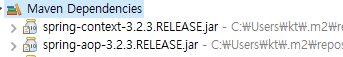

# 200109_Spring 실습2



## JDBC

- 자바에서 DB와 연결하는 표준 
- JDBC API : java SE의 rt.jar에 포함

- package java.sql.* : java SE 

  package javax.sql.* :  java EE


## JDBC driver


C:\oraclexe\app\oracle\product\11.2.0\server\jdbc\lib에 driver 위치

- JDBC Driver : ojdbc(숫자 : jdk version)



- 자동으로 jar가 추가되도록 설정

  

  `C:\Program Files\Java\jdk1.8.0_211\jre\lib\ext`

  `C:\Program Files\Java\jre1.8.0_211\lib\ext`

  에 ojdbc6.jar 추가

  

## 라이브러리 추가

- 라이브러리 관련 사이트에 가서 다운로드 받아서 라이브러리를 추가

- 라이브러리를 자동으로 업데이트 / 관리해주는 오픈소스 프레임워크 : Maven, gradle

- **Maven**

  - 라이브러리 자동 관리

  - 환경설정 ( =pom.xml )을 기반으로 원격 저장소에서 가져와서

    `C:/사용자/.m2` 폴더에 로컬로 다운받아 놓고 사용함

  

## Spring

- src/main/resources → **classpath**

  applicationContext.xml이 위치

- Singleton pattern 적용 : 하나만 만들어서 사용해

- `scope="prototype"` : new 명령어로 객체를 각각 만들어줘

  ``` HTML
  <bean id="messageBean" class="work.dto.MessageBean" scope="prototype">
      <property name="message" value="스프링 테스트 메세지"/>
      <property name="courseName"><value>자바 및 데이터베이스</value></property>
  </bean>
  ```

- 생성자 지정해서 객체 생성하기

  ``` html
  <!-- applicationContext.xml -->
  <!-- 순서대로 생성자의 arg로 넘어감 -->
  <bean id="messageBean" class="work.dto.MessageBean" >
      <constructor-arg value="A: Java &amp; DataBase" /> 
      <constructor-arg value="B: Spring Test Message" />
  </bean>	
  ```

  ``` java
  // MessageBean.java의 이 생성자를 사용해서 객체 생성
  public MessageBean(String message, String courseName) {
      this.message = message;
      this.courseName = courseName;
      System.out.println("(String, String)생성자 : " + message + " , " + courseName);
  }
  ```

- 생성자의 arg를 indexing해서 넘겨주기

  ```html
  <bean id="messageBean" class="work.dto.MessageBean" >
      <constructor-arg index="1" value="A: Java &amp; DataBase" /> 
      <constructor-arg index="0" value="B: Spring Test Message" />
  </bean>	
  ```

- **생성자 : constructor-arg 먼저 수행 → 이후에 setter() 메서드 : property 수행**

  ``` html
  <bean id="messageBean" class="work.dto.MessageBean" >
      <property name="message" value="스프링 프레임워크 및 부트"/>
      <property name="courseName" ><value>제4차 산업혁명 AI/SW 개발</value></property>
      <constructor-arg value="A : Java &amp; DataBase" /> 
      <constructor-arg value="B : Spring Test Message" />
  </bean>	
  ```

  ``` java
  // 출력 결과
  스프링 프레임워크 및 부트 | 제4차 산업혁명 AI/SW 개발
  스프링 프레임워크 및 부트 | 제4차 산업혁명 AI/SW 개발
  스프링 프레임워크 및 부트 | 제4차 산업혁명 AI/SW 개발
  ```

  

<br>

### Pattern

- Singleton pattern 

  - 하나의 클래스에 대해서 하나의 객체만을 생성해서 공유, 사용하기 위한 패턴

  - DAO pattern

  - 설계 규칙

    - private 생성자 : 외부에서 객체 생성 못하게 막음

      ``` java
      private static xxx instance = new xxx();
      ```

    - 외부에서 객체에 접근할 수 있는 함수 정의

      ``` java
      public static xxxgetInstance(){ return instance; }
      ```

- DTO pattern
- MVC pattern


#### 폴더 설정시 디렉토리 구분자

- Windows : `/`, `\\`

- unix : `/`


#### DI → DAO 클래스 의존관계

Test → Service → DAO → JDBC 연결 (Oracle)

DAO : applicationContext.xml에서 service에 dao를 리턴함 → 

```html
<bean id="dao" class="work.dao.CustomerDaoImpl">
    <constructor-arg value="oracle.jdbc.driver.OracleDriver" />
    <constructor-arg value="jdbc:oracle:thin:@localhost:1521:XE" />
    <constructor-arg value="hr" />
    <constructor-arg value="tiger" />
</bean>

<!-- service는 sigleton pattern -->
<bean id="service" class="work.service.CustomerServiceImpl" 
	factory-method="getInstance">
    
    <!-- 위에서 만든 dao를 참조함 -->
	<property name="dao" ref="dao" />
</bean>
```
#### JDBC : 자바와 DB 연결을 위한 리소스 Property

- DB의 jdbc driver

- DB 서버 URL 정보

  XE : 전역 SID 이름

- 계정 ID 

- 계정 PW


**※ 유지보수를 편하게 하기 위해 환경설정 파일 (applicationContext.xml)에 설정!**

``` html
<!-- applicationContext.xml -->
<bean id="dao" class="work.dao.CustomerDaoImpl">
    <constructor-arg value="oracle.jdbc.driver.OracleDriver" />
    <constructor-arg value="jdbc:oracle:thin:@localhost:1521:XE" />
    <constructor-arg value="hr" />
    <constructor-arg value="tiger" />
</bean>
```


``` html
<!-- beans-map.xml -->
<bean id="dao" class="work.dao.CustomerDaoImpl">
    <constructor-arg>
        <map>
            <entry key="driver" value="oracle.jdbc.driver.OracleDriver" />
            <entry key="url">
                <value>jdbc:oracle:thin:@localhost:1521:XE</value>
            </entry>
            <entry key="username">
                <value>hr</value>
            </entry>
            <entry key="password">
                <value>tiger</value>
            </entry>
        </map>
    </constructor-arg>
</bean>
```


#### Log 객체

``` properties
# log4j.properites
# Global logging configuration : fatal > error > warn > info > debug > trace
log4j.rootLogger=debug, console, file

# Console output...
log4j.appender.console=org.apache.log4j.ConsoleAppender
log4j.appender.console.layout=org.apache.log4j.PatternLayout
log4j.appender.console.layout.ConversionPattern=%5p ({%t} %F[%M]:%L) [%d] - %m%n

# DailyRollingFileAppender, RollingFileAppender
log4j.appender.file=org.apache.log4j.DailyRollingFileAppender
log4j.appender.file.File=C:/temp/log/log4j-sample.log
log4j.appender.file.Encoding=UTF-8
log4j.appender.file.Append=true
log4j.appender.file.DatePattern='.'yyyy-MM-dd
log4j.appender.file.layout=org.apache.log4j.PatternLayout
log4j.appender.file.layout.ConversionPattern=[%d{ISO8601}] [%-12t] %-5p %m%n
```


#### 다국어 지원

``` properties
# greeting_ko.properties
greeting=\uc548\ub155\ud558\uc138\uc694! 
message={0}: \uC11C\uBC84\uC810\uAC80\uC548\uB0B4

# {0}, {1}, ... : 동적으로 데이터를 받아와서 찍음
# ex) '아이디'를 입력하세요
#     '이름'을 입력하세요
```

``` html
<!-- applicationContext.xml -->
<bean id="messageSource"
    class="org.springframework.context.support.ResourceBundleMessageSource">
    <property name="basenames">
        <!-- 
            src/main/java/message/greeting.properties
            src/main/java/message/greeting_ko.properties
            src/main/java/message/greeting_en.properties

            src/main/java/message/error.properties
         -->
        <list>
            <!-- <value> 하위폴더명.propertites 파일명</value> -->
            <value>message.greeting</value>
            <value>message.error</value>
        </list>
    </property>

</bean>
```

